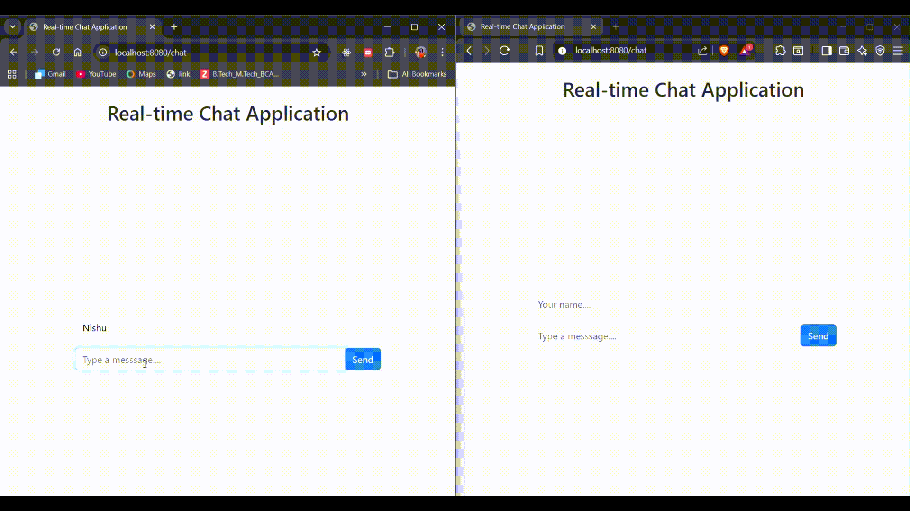

# 💬 Real-Time Chat Application

A simple **real-time chat application** built using **Spring Boot and WebSockets**.
This project demonstrates **bidirectional communication between client and server** using the **STOMP messaging protocol over WebSockets**.

Users can connect to the chat interface and exchange messages instantly without refreshing the page.

---

## 🚀 Features

* Real-time messaging using **WebSockets**
* **STOMP protocol** for message handling
* **SockJS fallback support** for browser compatibility
* Broadcast messages to all connected clients
* Simple UI built with **HTML, Bootstrap, and JavaScript**

---

## 🛠️ Tech Stack

* **Backend:** Spring Boot
* **Messaging:** WebSocket, STOMP
* **Frontend:** HTML, Bootstrap, JavaScript
* **Client Library:** SockJS, STOMP.js

---

## ⚙️ How It Works

1. The client establishes a **WebSocket connection** with the server using **SockJS**.
2. Messages are sent to the server endpoint:

```
/app/sendMessage
```

3. The server broadcasts messages to all connected clients through the topic:

```
/topic/messages
```

4. All subscribed clients receive the message instantly and display it in the chat interface.

---

## ▶️ Running the Application

1. Clone the repository

```bash
git clone https://github.com/sun-shine-57/realtime-chat-app.git
```

2. Navigate to the project folder

```bash
cd chat-app
```

3. Run the Spring Boot application

```bash
mvn spring-boot:run
```

4. Open the browser and go to

```
http://localhost:8080/chat
```

--- 

## 📸 Demo



---

## 📚 Purpose

This project was built for learning and experimenting with WebSockets in Spring Boot, focusing on understanding:

* Real-time communication

* Publish–subscribe messaging

* Client-server event-driven architecture
